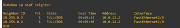

MPLS Traffic Engineering Lab
Explicit LSP Path Engineering with MPLS-TE & RSVP-TE

A hands-on Cisco IOS + GNS3 project exploring how traffic can be engineered across multiple paths using MPLS Traffic Engineering and RSVP-TE.

 

  

Topology ·
Implementation ·
Verification ·
Repository

🔎 Project Overview

This project implements MPLS Traffic Engineering (MPLS-TE) with RSVP-TE in a GNS3-based Cisco IOS network.

The main goal is to demonstrate how traffic can be given explicit path control instead of relying only on the normal OSPF shortest-path decision.

Two engineered paths were created between the ingress router R1 and the egress router R6:

PATH_A
R1 → R2 → R4 → R6

PATH_B
R1 → R3 → R5 → R6

Two MPLS-TE tunnels were configured so that each tunnel follows one of these explicit paths.

💡 Why This Project?

In a normal IP routing environment, OSPF selects paths according to its routing metric.

That works well for basic connectivity, but it does not provide direct control over how traffic should be placed across different available paths.

This project explores that problem using:

OSPF
↓
IP Reachability
↓
MPLS
↓
MPLS Traffic Engineering
↓
RSVP-TE
↓
Explicit LSP Paths

The result is a network where the engineered paths can be explicitly defined and verified.

🗺️ Topology

  

Network Paths
                     PATH_A
               R2 ───────── R4
              /              \
             /                \
           R1                  R6
             \                /
              \              /
               R3 ───────── R5
                     PATH_B

Endpoints

PC1
192.168.1.10
│
▼
R1
│
│ MPLS-TE
│
R6
│
▼
PC2
192.168.2.10

The actual engineered branches are:

PATH_A → R1 → R2 → R4 → R6

PATH_B → R1 → R3 → R5 → R6

⚙️ Implementation
Technologies
Technology	Role
GNS3	Network simulation
Cisco IOS	Router platform
OSPF	Interior routing / IP reachability
MPLS	Label-based forwarding
MPLS-TE	Traffic-engineered LSPs
RSVP-TE	Signaling and bandwidth reservation
Explicit Paths	Control over LSP routing
VPCS	Endpoint connectivity testing
🧩 Router Roles
Router	Role
R1	MPLS-TE ingress
R2	PATH_A intermediate router
R3	PATH_B intermediate router
R4	PATH_A intermediate router
R5	PATH_B intermediate router
R6	MPLS-TE egress
🛣️ Engineered Paths
PATH_A

R1
│
▼
R2
│
▼
R4
│
▼
R6

Explicit addresses:

10.0.12.2
10.0.24.2
10.0.46.2

PATH_B

R1
│
▼
R3
│
▼
R5
│
▼
R6

Explicit addresses:

10.0.13.2
10.0.35.2
10.0.56.2

🚇 MPLS-TE Tunnels

Two TE tunnels were configured on R1.

Tunnel	Destination	Explicit Path	Bandwidth
Tunnel0	R6	PATH_A	1500 kbps
Tunnel1	R6	PATH_B	1500 kbps
Tunnel0

interface Tunnel0
tunnel destination 10.255.0.6
tunnel mode mpls traffic-eng
tunnel mpls traffic-eng bandwidth 1500
tunnel mpls traffic-eng path-option 1 explicit name PATH_A
tunnel mpls traffic-eng autoroute announce

Tunnel1

interface Tunnel1
tunnel destination 10.255.0.6
tunnel mode mpls traffic-eng
tunnel mpls traffic-eng bandwidth 1500
tunnel mpls traffic-eng path-option 1 explicit name PATH_B
tunnel mpls traffic-eng autoroute announce

📡 RSVP-TE

RSVP-TE is used to signal the traffic-engineered tunnels and reserve their requested resources.

Each tunnel requests:

1500 kbps

The implementation successfully established two RSVP reservations between:

10.255.0.1 → 10.255.0.6

  

✅ Verification

The project was verified at multiple stages rather than relying only on end-to-end ping.

OSPF

show ip ospf neighbor
show ip route

  

Tunnel0 — PATH_A

show mpls traffic-eng tunnels tunnel 0

Expected operational state:

Admin: up
Oper: up
Path: valid
Signalling: connected

  

Tunnel1 — PATH_B

show mpls traffic-eng tunnels tunnel 1

Expected operational state:

Admin: up
Oper: up
Path: valid
Signalling: connected

  

🌐 End-to-End Connectivity
PC1

192.168.1.10

PC2

192.168.2.10

Connectivity was tested using:

ping 192.168.2.10

The endpoint ping was successful.

  

📊 What Was Verified?
Verification	Result
OSPF neighbor establishment	✅ Successful
OSPF route learning	✅ Successful
MPLS-TE Tunnel0	✅ Up
MPLS-TE Tunnel1	✅ Up
PATH_A	✅ Valid
PATH_B	✅ Valid
RSVP-TE reservations	✅ Established
PC1 → PC2 connectivity	✅ Successful
🎯 What This Project Demonstrates

This implementation demonstrates:

OSPF-based IP reachability

MPLS forwarding

MPLS Traffic Engineering

RSVP-TE signaling

Explicit LSP path selection

Bandwidth reservation

Multiple engineered paths

MPLS-TE tunnel establishment

End-to-end connectivity

⚠️ Performance Scope

This repository does not claim that MPLS-TE produced a specific percentage improvement in network performance.

The current work verifies the implementation and operation of the MPLS-TE environment.

A proper quantitative comparison would require a controlled traffic experiment comparing:

OSPF Baseline
↓
Traffic Load
↓
Measure Performance
↓
MPLS-TE + RSVP-TE
↓
Same Traffic Load
↓
Compare Results

Potential metrics for that experiment include:

Throughput

Delay

Packet loss

Link utilization

Path utilization

Behavior under congestion

🔬 Future Work

 Generate controlled traffic across the topology

 Establish an OSPF-only baseline

 Measure link utilization

 Measure throughput and delay

 Measure packet loss under load

 Introduce controlled congestion

 Compare OSPF and MPLS-TE results

 Test engineered-path failure and recovery

 Explore dynamic traffic engineering strategies

📁 Repository Structure

mpls-te-path-engineering/
│
├── assets/
│ ├── topology.png
│ ├── tunnel-path-a.png
│ ├── tunnel-path-b.png
│ ├── rsvp-reservations.png
│ ├── ospf-neighbors.png
│ ├── connectivity-test.png
│ ├── hero.gif
│ ├── logo.png
│ └── project-preview.png
│
├── configs/
│ ├── R1-running-config.txt
│ ├── R2-running-config.txt
│ ├── R3-running-config.txt
│ ├── R4-running-config.txt
│ ├── R5-running-config.txt
│ └── R6-running-config.txt
│
├── docs/
│ ├── implementation-notes.md
│ ├── viva-notes.md
│ └── README.md
│
├── gns3/
│ ├── mpls-te-path-engineering.gns3project
│ └── README.md
│
├── topology/
│ ├── addressing-plan.md
│ ├── topology-notes.md
│ └── README.md
│
├── verification/
│ ├── tunnel-commands.md
│ ├── rsvp-verification.md
│ ├── connectivity-tests.md
│ └── README.md
│
├── .gitignore
├── LICENSE
└── README.md

🧪 Reproducing the Lab

To reproduce the project:

Install GNS3.

Use a compatible Cisco IOS image.

Import the GNS3 project from gns3/.

Start the routers and VPCS nodes.

Verify OSPF connectivity.

Verify MPLS-TE tunnel status.

Verify RSVP-TE reservations.

Test PC1-to-PC2 connectivity.

Note: Cisco IOS images are intentionally not included in this repository.

📚 Documentation

More detailed information is available in:

docs/implementation-notes.md

docs/viva-notes.md

topology/addressing-plan.md

topology/topology-notes.md

verification/tunnel-commands.md

verification/rsvp-verification.md

verification/connectivity-tests.md

📖 References

D. Awduche et al., "Requirements for Traffic Engineering Over MPLS," RFC 2702, IETF, 1999.

D. Awduche et al., "RSVP-TE: Extensions to RSVP for LSP Tunnels," RFC 3209, IETF, 2001.

Cisco, "MPLS Basic Traffic Engineering Using OSPF Configuration Example."

Celestino Jr. et al., "FuDyLBA: A Traffic Engineering Load Balance Scheme for MPLS Networks Based on Fuzzy Logic," Springer, 2004.

Cisco, "MPLS Traffic Engineering Path Calculation and Setup Configuration Guide."

Built and tested in GNS3

MPLS • MPLS-TE • RSVP-TE • OSPF • Cisco IOS

