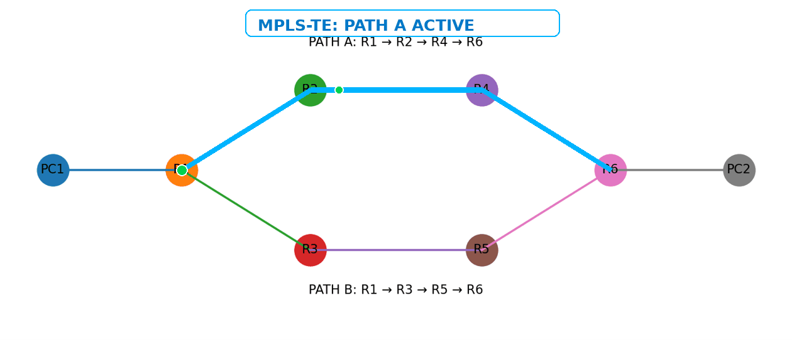
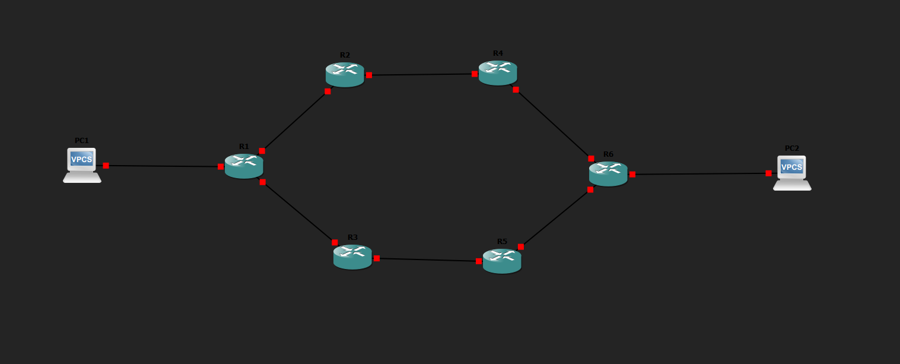
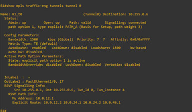
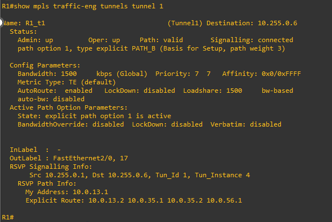
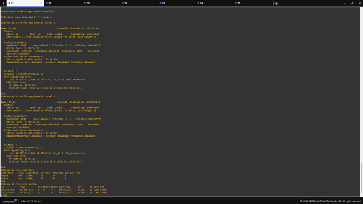
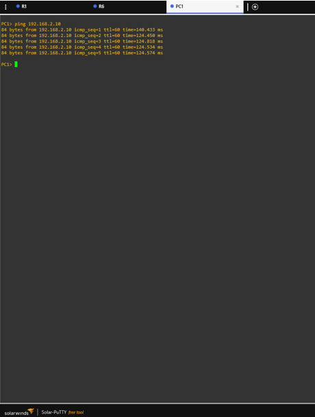

<div align="center">

# ⚡ MPLS-TE PATH ENGINEERING

### Two paths. One destination. More control over the traffic.

<br>


<br><br>

[ **TOPOLOGY** ](#-the-network) &nbsp; • &nbsp;
[ **IMPLEMENTATION** ](#-how-it-works) &nbsp; • &nbsp;
[ **VERIFICATION** ](#-proof-it-worked) &nbsp; • &nbsp;
[ **CONFIGS** ](#-project-files) &nbsp; • &nbsp;
[ **REPORT** ](#-documentation)

</div>

---

<div align="center">

## 🎬 THE PROJECT IN ACTION



</div>

---

# 🧭 Why I Built This

I wanted to work on a networking problem that was more interesting than simply making two computers ping each other.

The network has **more than one possible path** between the source and destination.

That creates a simple question:

> **If I have two possible paths, how much control can I get over where the traffic actually goes?**

So I built the network in GNS3 and used **MPLS Traffic Engineering (MPLS-TE)** with **RSVP-TE** to create explicitly engineered paths between the ingress and egress routers.

---

# 🚦 The Problem

The network contains two feasible paths:

```text
                           PATH A
                    ┌── R2 ───── R4 ──┐
                    │                 │
                    │                 │
PC1 ─────────────── R1                 R6 ─────────────── PC2
                    │                 │
                    │                 │
                    └── R3 ───── R5 ──┘
                           PATH B
```

With normal IP routing, the network primarily makes forwarding decisions based on routing metrics.
When traffic conditions change, one feasible path can become heavily utilized while another path still has available capacity.
The project therefore focuses on:

```text
Multiple feasible paths
        ↓
Changing traffic conditions
        ↓
Need for better path control
        ↓
MPLS Traffic Engineering
```

### 🌐 The Network

The lab contains:
- 6 × Cisco 7200 routers
- 2 × VPCS hosts
- OSPF
- MPLS
- MPLS Traffic Engineering
- RSVP-TE
- 2 explicit TE paths
- 2 TE tunnels

Topology
                           PATH A
                    ┌── R2 ───── R4 ──┐
                    │                 │
                    │                 │
PC1 ─────────────── R1                 R6 ─────────────── PC2
                    │                 │
                    │                 │
                    └── R3 ───── R5 ──┘
                           PATH B

<p align="center">
  
</p>

🛣️ Two Engineered Paths
PATH A
R1 → R2 → R4 → R6

Configured as:
PATH_A

PATH B
R1 → R3 → R5 → R6

Configured as:
PATH_B

The two paths were deliberately created so that traffic engineering could be observed and verified rather than using a single route.
🧠 How The Pieces Fit Together
The implementation uses several networking technologies together:
                    OSPF
                     │
                     │
              Network topology
              and IP reachability
                     │
                     ▼
                   MPLS
                     │
                     │
              Label forwarding
                     │
                     ▼
                 MPLS-TE
                     │
                     │
               Path control
                     │
                     ▼
                 RSVP-TE
                     │
                     │
            Signaling + reservation
                     │
                     ▼
               TE LSP / Tunnel

In simple terms
Technology	Role in this project
OSPF	Underlying IP routing and topology information
MPLS	Label-based forwarding
MPLS-TE	Traffic path engineering
RSVP-TE	TE tunnel signaling and resource reservation
Explicit Paths	Define the intended route
GNS3	Virtual network environment


⚙️ Implementation
MPLS-TE
The routers were configured to support MPLS Traffic Engineering:
```text
ip cef
mpls traffic-eng tunnels
```

OSPF was configured to provide TE information:
```text
router ospf 1
 mpls traffic-eng area 0
 mpls traffic-eng router-id Loopback0
```

📡 RSVP-TE
RSVP-TE was used for signaling and bandwidth reservation.
The TE tunnels were configured with:
```text
1500 kbps
```

The reservation state was then checked directly from the router.
🛣️ PATH_A Configuration
The first explicit path was:
```text
R1 → R2 → R4 → R6
```

The TE tunnel was configured on R1 as:
```text
interface Tunnel0
 ip unnumbered Loopback0
 tunnel destination 10.255.0.6
 tunnel mode mpls traffic-eng
 tunnel mpls traffic-eng bandwidth 1500
 tunnel mpls traffic-eng path-option 1 explicit name PATH_A
 tunnel mpls traffic-eng autoroute announce
```

🛣️ PATH_B Configuration
The second explicit path was:
```text
R1 → R3 → R5 → R6
```

The second TE tunnel was configured as:
```text
interface Tunnel1
 ip unnumbered Loopback0
 tunnel destination 10.255.0.6
 tunnel mode mpls traffic-eng
 tunnel mpls traffic-eng bandwidth 1500
 tunnel mpls traffic-eng path-option 1 explicit name PATH_B
 tunnel mpls traffic-eng autoroute announce
```

🔍 Proof It Worked
I verified the implementation directly from the routers rather than only relying on the configuration being accepted.

🟢 Tunnel 0 — PATH_A

Command:
```text
show mpls traffic-eng tunnels tunnel 0
```

The tunnel was verified as:
```text
Admin up
Oper up
Path valid
Signalling connected
```

The explicit route followed:
```text
R1 → R2 → R4 → R6
```

<p align="center">
  
</p>

🔵 Tunnel 1 — PATH_B

Command:
```text
show mpls traffic-eng tunnels tunnel 1
```

The tunnel was verified as operational with the explicit PATH_B route:
```text
R1 → R3 → R5 → R6
```

<p align="center">
  
</p>

📡 RSVP Reservation Verification
I checked the RSVP state using:
```text
show ip rsvp interface
```

and:
```text
show ip rsvp reservation
```

The configured 1500K reservations were visible on the relevant R1 interfaces.
<p align="center">
  
</p>

📶 End-to-End Connectivity
After configuring the network and TE tunnels, I tested connectivity from PC1 to PC2.
ping 192.168.2.10

The end-to-end ICMP test succeeded.
<p align="center">
  
</p>

📊 Project Snapshot
<div align="center">

	
🖥️ Virtual Lab	GNS3
🌐 Routers	6 × Cisco 7200
💻 Hosts	2 × VPCS
🔀 Routing	OSPF
🏷️ Switching	MPLS
🛣️ Traffic Engineering	MPLS-TE
📡 Signaling	RSVP-TE
🧭 Engineered Paths	2
🚇 TE Tunnels	2
📶 Tunnel Bandwidth	1500 kbps
🔗 Connectivity	PC1 → PC2 verified


</div>

⚖️ Baseline vs Proposed Approach
The project was designed around two network states.
BASELINE
```text
Normal IP Routing
       +
      OSPF

PROPOSED
      OSPF
       +
      MPLS
       +
    MPLS-TE
       +
    RSVP-TE
       +
 Explicit Paths
```

The baseline provides normal IP reachability.
The proposed design adds explicit path control and bandwidth reservation through MPLS-TE.
🧪 Changing Network Conditions
The main condition considered by the project is changing traffic demand.
The idea is:
```text
Low traffic
     ↓
Medium traffic
     ↓
High traffic
     ↓
Observe path/resource behavior
```

The intended measurements are:
Throughput
Delay
Packet loss
Interface utilization
Path behavior

⚠️ A Note About The Results
I am deliberately not inventing a performance improvement percentage.
The captured implementation evidence verifies:
- OSPF connectivity
- MPLS-TE configuration
- RSVP-TE signaling
- explicit paths
- TE tunnel establishment
- bandwidth reservation
- end-to-end connectivity
However, the current captured evidence does not contain a completed controlled high-load baseline-versus-MPLS-TE performance experiment.
So I am not claiming:
"Throughput improved by X%"

without actually measuring it.
That experiment is the natural next step.
🧪 What I Would Test Next

```text
                 CONTROLLED TRAFFIC
                        │
                        ▼
                ┌───────────────┐
                │    BASELINE   │
                │    IP / OSPF  │
                └───────┬───────┘
                        │
                  Measurements
                        │
                        ▼
                ┌───────────────┐
                │    MPLS-TE    │
                │  ENGINEERED   │
                └───────┬───────┘
                        │
                  Measurements
                        │
                        ▼
                   COMPARISON
                        │
             ┌──────────┼──────────┐
             ▼          ▼          ▼
         Throughput   Delay      Loss
                        +
                    Utilization
```

Possible extensions:
- [ ] Controlled traffic generation
- [ ] Baseline vs MPLS-TE throughput comparison
- [ ] Delay comparison
- [ ] Packet-loss comparison
- [ ] Interface utilization analysis
- [ ] Failure and recovery testing
- [ ] Automatic bandwidth adjustment
- [ ] Larger topology
- [ ] More dynamic traffic-engineering logic


📁 Project Structure
mpls-te-path-engineering/
├── assets/
│   ├── hero.gif
│   ├── topology.png
│   ├── tunnel-path-a.png
│   ├── tunnel-path-b.png
│   ├── rsvp-reservations.png
│   └── connectivity-test.png
│
├── configs/
│   ├── R1-running-config.txt
│   ├── R2-running-config.txt
│   ├── R3-running-config.txt
│   ├── R4-running-config.txt
│   ├── R5-running-config.txt
│   └── R6-running-config.txt
│
├── docs/
│   ├── project-report.pdf
│   └── viva-notes.md
│
├── topology/
│   ├── addressing-plan.md
│   └── topology-notes.md
│
├── verification/
│   ├── tunnel-commands.md
│   ├── rsvp-verification.md
│   └── connectivity-tests.md
│
├── .gitignore
├── LICENSE
└── README.md

📂 Explore the Repository
⚙️ Router Configurations

→ configs/

Actual router configurations used in the GNS3 implementation.

📐 Topology

→ topology/

Addressing plan and topology information.

🔍 Verification

→ verification/

Commands and evidence used to verify the network.

📄 Documentation

→ docs/

Full project report and supporting documentation.

🧰 Tools & Technologies

🖥️ GNS3 — Network topology simulation and implementation

🔧 Cisco IOS — Router configuration

🌐 OSPF — Interior Gateway Protocol

🔀 MPLS — Multiprotocol Label Switching

🚦 MPLS-TE — MPLS Traffic Engineering

📡 RSVP-TE — Resource Reservation Protocol – Traffic Engineering
<div align="center">

GNS3   Cisco IOS   OSPF   MPLS   MPLS-TE   RSVP-TE
</div>

📚 References
1. D. Awduche et al., Requirements for Traffic Engineering Over MPLS, RFC 2702, IETF, 1999.
2. D. Awduche et al., RSVP-TE: Extensions to RSVP for LSP Tunnels, RFC 3209, IETF, 2001.
3. Cisco, MPLS Basic Traffic Engineering Using OSPF Configuration Example.
4. J. Celestino Jr. et al., FuDyLBA: A Traffic Engineering Load Balance Scheme for MPLS Networks Based on Fuzzy Logic, Telecommunications and Networking – ICT 2004, Springer.
5. Cisco, MPLS Traffic Engineering Path Calculation and Setup Configuration Guide, Cisco IOS Release 12.4T.

⚠️ Reproduction Note
The Cisco IOS image used for the GNS3 routers is not included in this repository.
To reproduce the lab, an appropriately licensed Cisco IOS image with the required MPLS-TE/RSVP-TE capabilities is required.
The repository contains my project configurations, topology information, verification commands and documentation.
<div align="center">

Built, configured and tested by me.
MPLS-TE Path Engineering
GNS3 • Cisco IOS • OSPF • MPLS • RSVP-TE

⭐ If you found the project useful, feel free to explore the configurations and verification steps.
</div>
```
